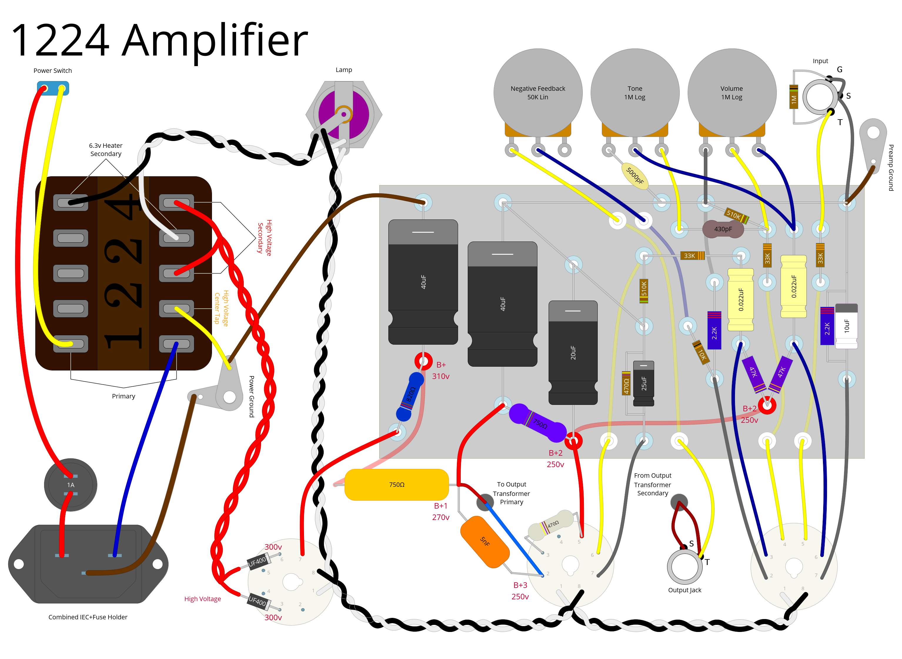

# 1224 Amplifier

This repository contains the source files for a tube amplifier as I go through the process of designing and building the prototype.

## Background

The origins of this amplifier begin with a [Philco model 1224](https://www.vintageradio.co.nz/model/philco/1224). I originally picked up a non-functioning unit with the intent of restoring it to a working state, but it very quickly became apparent that this wouldn't be possible. I did manage to salvage a working power transformer, output transformer and speaker from the otherwise useless components and chassis.

After tracking down a [schematic of the original radio](https://www.vintageradio.co.nz/static/images/models/philco/1224/Philco_1224_schematic.png), the new plan became to try and build a guitar amplifier instead.

I am a complete novice at this electronics thing, so this repository also serves as a record of my progress in learning and (hopefully!) understanding.

## Provided files

- [bom.csv](bom.csv) - a simple Bill of Materials for the major components (excludes wiring, transformers, and off-board hardware).
- [layout-main.diy](layout-main.diy) - the main chassis layout in [DIY Layout Creator](https://github.com/bancika/diy-layout-creator) format. This layout includes the eyelet board, all components, all off-board wiring, all hardware and both transformers. The eyelet colours indicate their purpose:
  - blue - standard eyelets, every component or wire which arrives at these junctions are electrically connected.
  - red - similar to blue eyelets, red eyelets just indicate the B+ voltage test points. These same points correlate with the labelled B+ test points also given in the [schematic](schematic.sch).
  - white - these eyelets act as holes for wiring to pass through to the underside of the eyelet board **without making an electrical connection to the eyelet**. The intent is to keep the eyelet board free from fly wires running over the top of components, whilst keeping the wiring as tidy as possible.
- [layout-main.pdf](layout-main.pdf) - a vector PDF render of the main chassis layout, exported from DIY Layout Creator.
- [layout-main.png](layout-main.png) - an image render of the main layout, as seen at the top of this README.
- [layout-underside.diy](layout-underside.diy) - this is an isolated layout of just the eyelet board, **shown from the underside**. This layout _only_ includes the eyelet board (which has been flipped horizontally), all underside jumper wires (or wires which have passed through from above the eyelet board), and the large off-board 750&#8486; resistor (because it connects to the underside of the board). All other components, off-board wiring, transformers and hardware are excluded for clarity. The eyelet colours (and their meanings) from [layout-main.pdf](layout-main.pdf) have been retained.
- [layout-underside.pdf](layout-underside.pdf) - a vector PDF render of the isolated underside board layout, exported from DIY Layout Creator.
- [schematic.sch](schematic.sch) - the schematic, in [Qucs-S](https://ra3xdh.github.io/) format.
- [schematic.png](schematic.png) - an image render of the schematic, as seen at the top of this section.

## Design goals

### Power

In my lack of experience, I've used as much as possible from existing schematics. The power supply, rectification, filtering and output stages have been lifted almost exactly from the original schematic. The only significant deviations from the original in this section are:

- replacing the three capacitor can with individual capacitors of the same value and rating; and
- replacing the 1500 Ω, centre-tapped power resistor with two 750 Ω resistors (of appropriate power dissipation) in series.

This is simply to reduce costs and make the final amplifier more serviceable in future.

A minor deviation from the original is to separate the grounding of the filter capacitors. In the original schematic, the three capacitor can is grounded, but it isn't clear exactly where the component is actually grounded within the chassis.

I have opted to ground the first filter capacitor separately, as close as possible to the power transformer's high voltage secondary center tap. The remaining filter capacitors have been attached to the preamp's ground rail, which eventually gets grounded at a chassis lug near the input jack.

### Preamp

The preamp is comprised of a chain of cascading gain stages, provided by two 7F7 dual triode tubes. The circuit input could be described as a single-jack implementation of a style typical of many vintage Fender amplifiers:
- R2 (68K) provides grid stopper duties for the first gain stage; and
- R1 (1M) provides a high impedance to the source.

I've also used 68K grid stopper resistors through the rest of the gain stages too, though I suspect that will need tweaking.

A potentiometer is inserted between the first two gain stages (to act as a Gain control), and another potentiometer is inserted between the last gain stage and the power tube grid (to act as a Master Volume). I suspect my wiring for the Gain potentiometer may be backwards, based on my initial investigation into drawing load lines for the 7F7.

A three band tone circuit - lifted from the classic [Fender Bassman (5F6-A)](https://en.wikipedia.org/wiki/Fender_Bassman) and modified only very slightly - is added after the third gain stage, with the last gain stage intended to reclaim some of the losses incurred by the tone circuit.

### Summary

What I'm left with is an untested prototype circuit which should **not** be considered safe/accurate/working/usable in any capacity.

## References

I took a lot of learning and guidance from other "similar" schematics and the teaching of much more learned individuals while coming up with this design. I stand upon the shoulders of giants, and they are mentioned here in no particular order:

### General

- [https://el34world.com/charts/grounds.htm](https://el34world.com/charts/grounds.htm)
- [https://www.ampbooks.com/mobile/amplifier-calculators/cathode-capacitor/calculator/](https://www.ampbooks.com/mobile/amplifier-calculators/cathode-capacitor/calculator/)
- [https://www.youtube.com/playlist?list=PLhk_5-kIFMR6hYTqkiCGOVxa3RP3x8FsA](https://www.youtube.com/playlist?list=PLhk_5-kIFMR6hYTqkiCGOVxa3RP3x8FsA)
- [https://www.analogethos.com/blog/search/tube%20amplifier](https://www.analogethos.com/blog/search/tube%20amplifier)
- [https://northcoastsynthesis.com/news/how-to-choose-component-values/](https://northcoastsynthesis.com/news/how-to-choose-component-values/)
- [https://www.valvewizard.co.uk/localfeedback.html](https://www.valvewizard.co.uk/localfeedback.html)
- [https://el34world.com/charts/currentflow.htm](https://el34world.com/charts/currentflow.htm)

### Load Lines

- [https://robrobinette.com/Drawing_Tube_Load_Lines.htm](https://robrobinette.com/Drawing_Tube_Load_Lines.htm)
- [https://www.analogethos.com/post/load-lines](https://www.analogethos.com/post/load-lines)

### Biasing

- [https://robrobinette.com/How_to_Bias_a_Tube_Amp.htm](https://robrobinette.com/How_to_Bias_a_Tube_Amp.htm)
- [https://www.youtube.com/watch?v=L3rRk3eSTnA](https://www.youtube.com/watch?v=L3rRk3eSTnA)
- [https://www.youtube.com/watch?v=ucG3s863x1c](https://www.youtube.com/watch?v=ucG3s863x1c)
- [https://guitarscience.net/tsc/info.htm](https://guitarscience.net/tsc/info.htm)
- [https://www.youtube.com/watch?v=BatwDYFJ9ug](https://www.youtube.com/watch?v=BatwDYFJ9ug)
- [https://www.ampbooks.com/mobile/classic-circuits/bassman-tonestack/](https://www.ampbooks.com/mobile/classic-circuits/bassman-tonestack/)
- [https://robrobinette.com/How_The_TMB_Tone_Stack_Works.htm](https://robrobinette.com/How_The_TMB_Tone_Stack_Works.htm)
